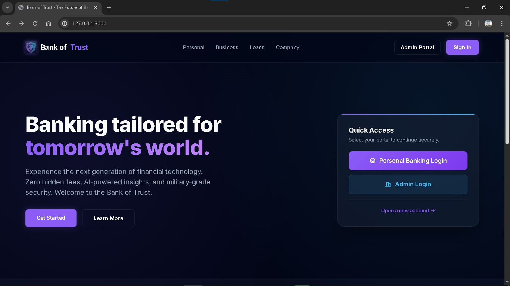
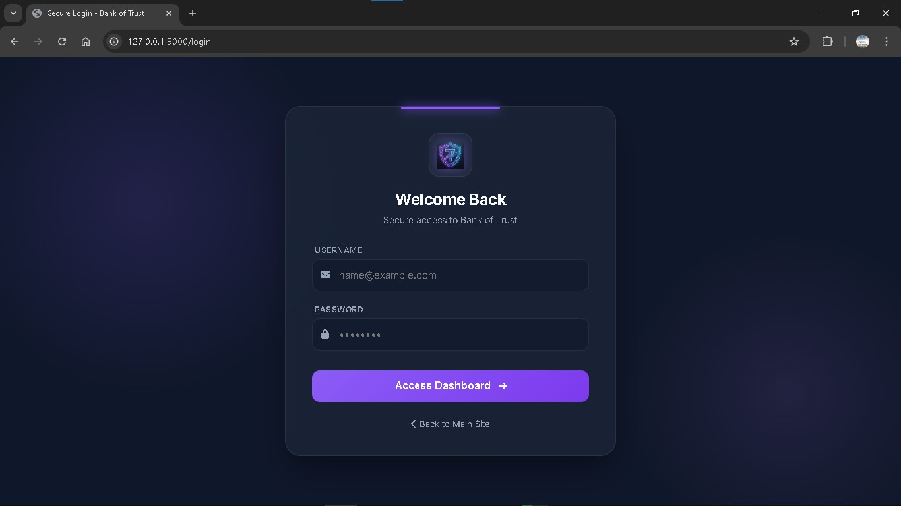
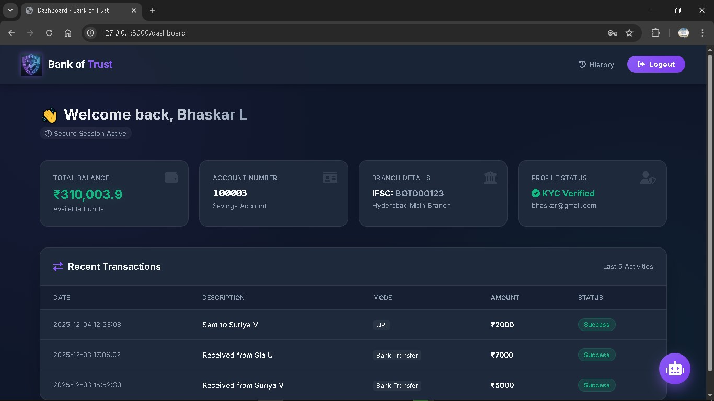
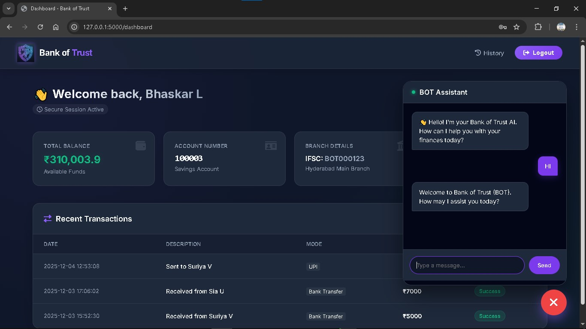
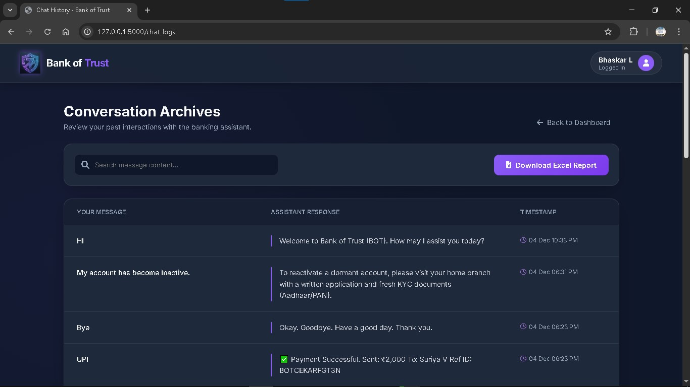
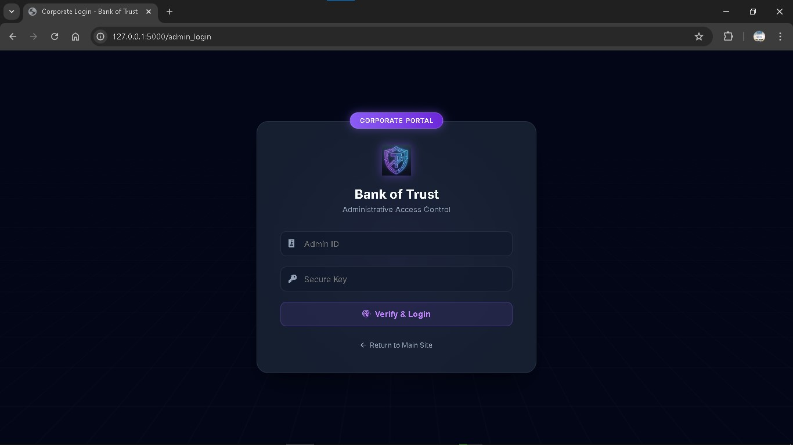
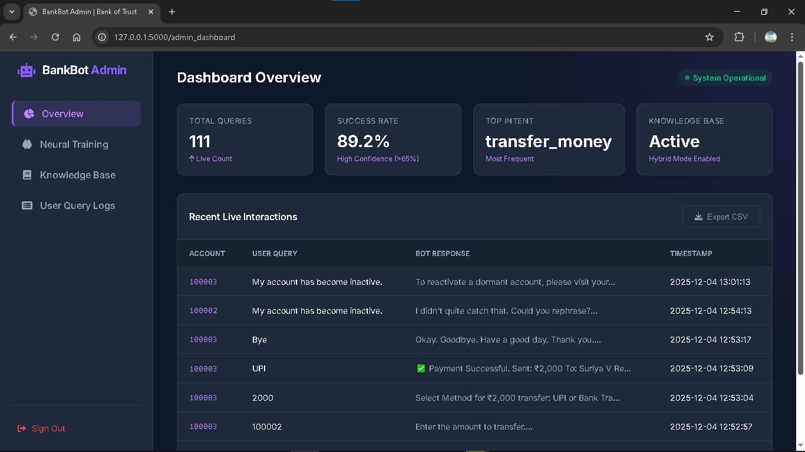
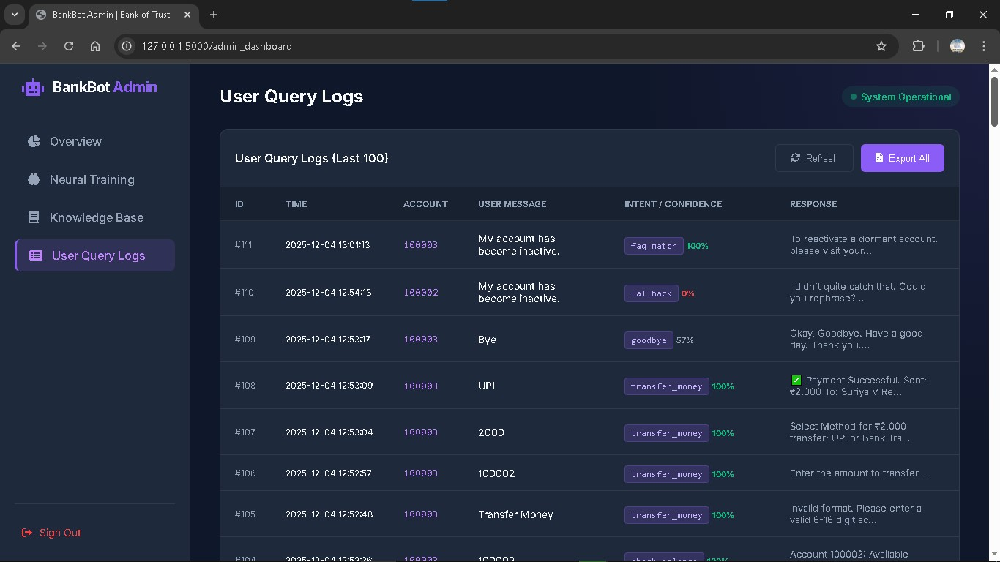

# 🏦 Bank of Trust (BOT) with BankBot - AI Banking Assistant

> **A Next-Generation Neo-FinTech Banking Platform powered by Context-Aware AI BankBot.**

## 📖 Overview

**BankBot** is a robust, full-stack banking prototype developed as a **Capstone Project** during my recent engineering internship. Designed to demonstrate the future of digital finance, it bridges the gap between traditional transaction management and modern conversational AI, simulating a real-world banking environment where user experience and operational efficiency are paramount.

In the highly regulated FinTech sector, reliance on manual customer service often leads to bottlenecks. BankBot addresses this by implementing a **Hybrid Intelligence System**. Unlike standard chatbots that rely solely on generative text, BankBot fuses **Rule-Based Logic** (for strict, secure operations like fund transfers and loan eligibility) with **Machine Learning** (TF-IDF & Logistic Regression for flexible intent recognition). This ensures that the system remains conversational and accessible while guaranteeing the safety and determinism required for financial data.

This project serves as a proof-of-concept for reducing operational costs and improving customer engagement through automation, featuring a "Neo-FinTech" user dashboard, a real-time transaction ledger, and a dynamic administrative backend.

### 🌟 Core Value Propositions

* **🕒 24/7 Availability:** Instantly resolves recurring queries (e.g., balance checks, routing numbers, card blocking) at any time of day, significantly reducing queue times.
* **🛡️ Secure & Deterministic Transactions:** Uses a State Machine architecture to handle sensitive actions, ensuring the AI never "hallucinates" a transaction or loan approval.
* **🧠 Dynamic Learning Engine:** Features a custom-built **Admin Nexus** that allows non-technical staff to update the Knowledge Base and retrain the NLU model in real-time without server downtime.
* **📊 Operational Analytics:** Provides a comprehensive audit trail and analytics dashboard to monitor user intent distribution, confidence scores, and system success rates.
* **💻 Seamless Integration:** A fully responsive web interface that unifies the chat experience with the user's core banking dashboard and transaction history.
-----

## 👨‍💻 Technologies Stack
- **Frontend:** HTML5, CSS3 (Glassmorphism), JavaScript, Bootstrap, Dash
- **Backend:** Python, Flask, SQLite
- **AI & NLU:** Scikit-Learn (TF-IDF, Logistic Regression), Custom State Machine
- **Database:** SQLite (User Data, Transaction Ledger, Chat Logs)
- **Version Control:** Git, GitHub
- **Pakage Management:** pip

-----

## 🚀 Key Features

### 🤖 Intelligent AI Chatbot (`dialogue_manager.py`)

* **Context-Aware NLU:** The bot maintains conversation context (e.g., remembering you are in the "Loan" menu while answering questions).

* **Hybrid Logic:** Combines Machine Learning (TF-IDF/Logistic Regression) for general FAQs with a deterministic State Machine for secure operations (Transactions, KYC).

* **Smart Routing:** Prevents input conflicts (e.g., distinguishing between menu selection "1" and an amount "1").

### 💻 Neo-FinTech Frontend

* **Modern UI:** Built with a "Deep Void" (`#020617`) and "Electric Purple" (`#7c3aed`) theme.

* **Glassmorphism:** Translucent cards and sidebars for a premium feel.

* **Responsive Design:** Fully responsive Dashboards and Chat Interfaces.

### 🛡️ Secure Backend & Database

* **Role-Based Access:** Separate portals for **Retail Users** and **Corporate Admins**.

* **SQLite Transaction Ledger:** Records every transaction with timestamps and status.

* **Session Management:** Secure Flask sessions prevent unauthorized access.

-----

## 📂 Project Structure

```text
BankBot_AI_Chatbot_for_Banking_FAQs/
│
├── app.py                      # Main Flask Web Server
├── dialogue_manager.py         # AI Logic & State Machine (The Brain)
├── bank_db.py                  # Database Schema & Helper Functions
├── setup_users.py              # Script to seed dummy users & data
├── requirements.txt            # Python Dependencies
├── bankbot_final_expanded1.csv # NLU Training Dataset
├── README.md                   # Project Documentation
├── .gitignore                  # Git Ignore File
│
├── static/
│   ├── css/
│   │   └── admin_style.css     # The Neo-FinTech CSS Theme
│   └── Images/                 # Logos, Screenshots
|       ├── home_page.jpg
|       ├── login_page.jpg
|       ├── customer_dashboard.jpg
|       ├── chat_interface.jpg
|       ├── query_history.jpg
|       ├── admin_login.jpg
|       ├── admin_dashboard.jpg
|       ├── logo0.png
|       └── chat_logs.jpg
│
└── templates/
    ├── admin_home.html         # Landing Page
    ├── Login.html              # Customer Login
    ├── dashboard.html          # Customer Dashboard
    ├── chat.html               # Chatbot Window (Iframe)
    ├── chat_logs.html          # Customer Chat History
    ├── admin_login.html        # Corporate Login
    └── admin_dashboard.html    # Corporate Admin Dashboard
```

-----

## ⚡ Installation & Setup Guide

Follow these steps to get the project running on your local machine.

### 1. Clone the Repository
```bash
git clone [https://github.com/sairajeshkadali/BankBot_AI_Chatbot_for_Banking_FAQs.git](https://github.com/sairajeshkadali/BankBot_AI_Chatbot_for_Banking_FAQs.git)
cd BankBot_AI_Chatbot_for_Banking_FAQs
```

-----

### 2\. Create a Virtual Environment (Recommended)

It is best practice to run Python projects in a virtual environment.

**Windows:**

```bash
python -m venv venv
venv\Scripts\activate
```

**Mac/Linux:**

```bash
python3 -m venv venv
source venv/bin/activate
```

-----

### 3\. Install Dependencies

```bash
pip install -r requirements.txt
```

> **Note:** This will install Flask, Pandas, Scikit-Learn, and other required libraries.

-----

### 4\. Initialize the Database

You must run the database scripts to create the tables and add test users.

**Step A: Create Tables**

```bash
python bank_db.py
```

*Output:* `✅ Bank of Trust Database Ready.`

**Step B: Seed Users**

```bash
python setup_users.py
```

*Output:* `✅ Users Seeded Successfully...`

-----

### 5\. Run the Application

```bash
python app.py
```

You will see: `* Running on http://127.0.0.1:5000`

-----

## 🔑 Demo Login Credentials

Use these credentials to explore the different user roles.

### 👤 Retail Customer Portal

  * **URL:** `http://127.0.0.1:5000/login`
  * **Access:** Click "Sign In" on the Home Page.

| Name | Email (Login ID) | Password | Initial Balance |
| :--- | :--- | :--- | :--- |
| **Sia U** | `sia@gmail.com` | `Sia@1234` | ₹25,00,000 |
| **Suriya V** | `suriya@gmail.com` | `Suriya@123` | ₹24,20,000 |
| **Bhaskar L** | `bhaskar@gmail.com` | `Bhaskar@123` | ₹3,00,000 |

### 🏢 Corporate Admin Portal

  * **URL:** `http://127.0.0.1:5000/admin_login`
  * **Access:** Click "Admin Portal" on the Home Page.

| Role | Username | Password |
| :--- | :--- | :--- |
| **System Administrator** | `admin_bot` | `trust@2025` |

-----

## 📸 Project Screenshots

| **Home Page** | **Customer Login** |
|:---:|:---:|
|  |  |

| **Customer Dashboard** | **AI Chatbot Interface** |
|:---:|:---:|
|  |  |

| **History of Queries** | **Admin Login** |
|:---:|:---:|
|  |  |

| **Admin Dashboard** | **User Query Logs** |
|:---:|:---:|
|  |  |

-----

## 🛠️ Roadmap & Future Enhancements

  * [ ] **WhatsApp Integration:** Connect the bot to the WhatsApp Business API for wider accessibility.
  * [ ] **Voice Interface:** Implement Speech-to-Text (STT) and Text-to-Speech (TTS) for hands-free banking.
  * [ ] **Multi-Currency Support:** Expand the database to handle international currencies and exchange rates.
  * [ ] **Advanced Analytics:** Add visualization tools to the Admin Dashboard for deeper insights into user behavior.
  * [ ] **PDF Statement Generation:** Allow users to download transaction history as official PDF documents.

-----

## Project Milestones

This project is being built according to the 8-week Infosys Springboard Virtual Internship plan:
* **Milestone 1: NLU Engine:** Define intents and entities, and train a validated NLU model.
* **Milestone 2: Dialogue Management:** Implement dialogue policies and actions using Spacy.
* **Milestone 3: UI Integration:** Connect the frontend to the Flask & Spacy backend.
* **Milestone 4: Admin Panel:** Build the secure admin dashboard for maintenance and improvement.

-----


## 📜 License & Acknowledgments

This project was developed as part of the **Infosys Springboard Virtual Internship**.
All rights reserved.
